# <Social Network API>

## Description

This API focuses on user data for connecting through social networks. It is a fundamental part of full-stack applications and I did it to practice MongoDB back-end logic. It helped me bridge a deeper understanding of NoSQL and the subtles differences between SQL. I learned how to use Mongoose for NoSQL similar to Sequelize for SQL. 

## Table of Contents (Optional)

If your README is long, add a table of contents to make it easy for users to find what they need.

- [Installation](#installation)
- [Usage](#usage)
- [Credits](#credits)
- [License](#license)

## Installation

> clone repository 
>> npm i
>>> mysql -u 'username' -p'password'
>>> source ./db/
>>>> npm run start
>>>>> Insomnia to test routes

## Usage

[Repository](https://github.com/tdickson96/Social-Network-API)

[Walkthrough](https://drive.google.com/file/d/1TA1hUhjCJ5Mo071cHMi7tC-JFIrGEKvZ/view?usp=sharing) 

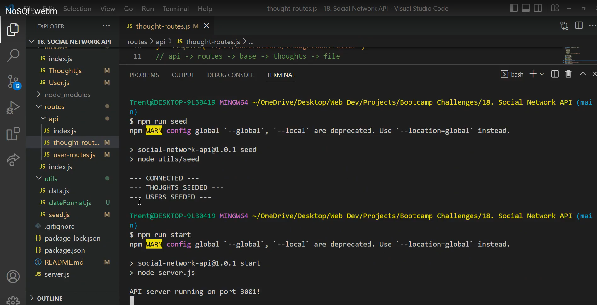
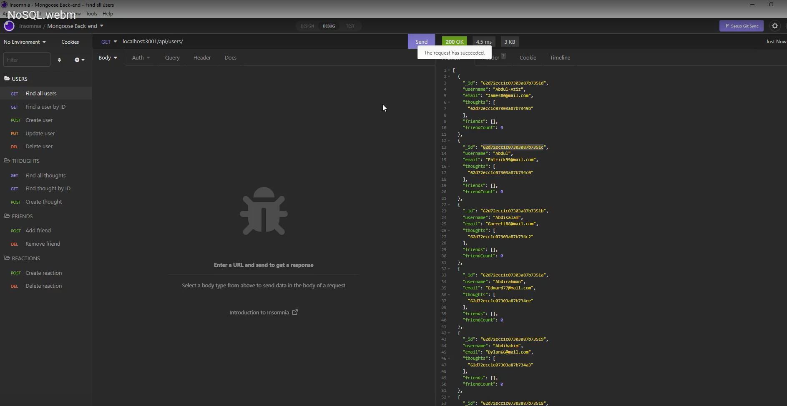
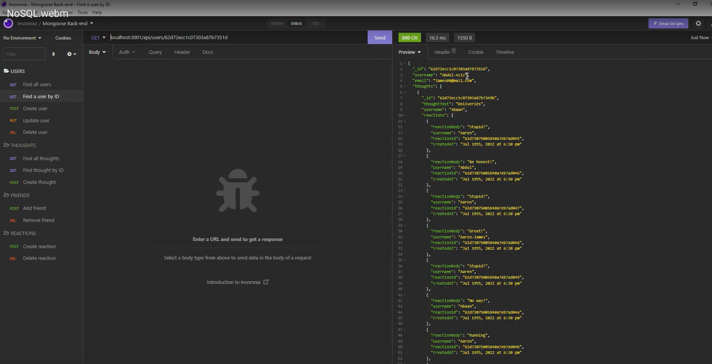
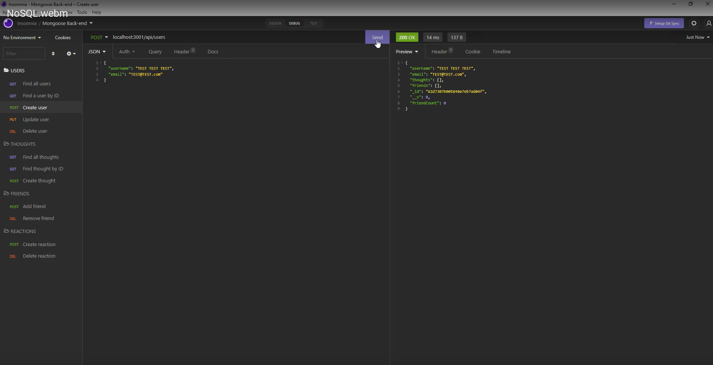
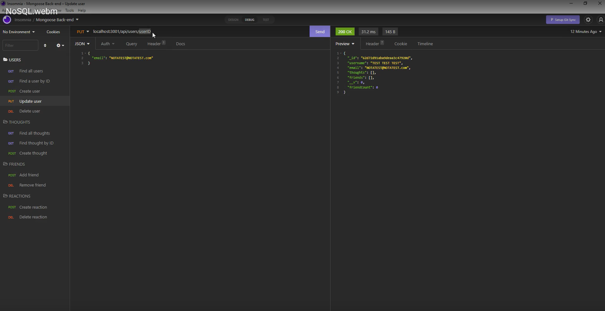
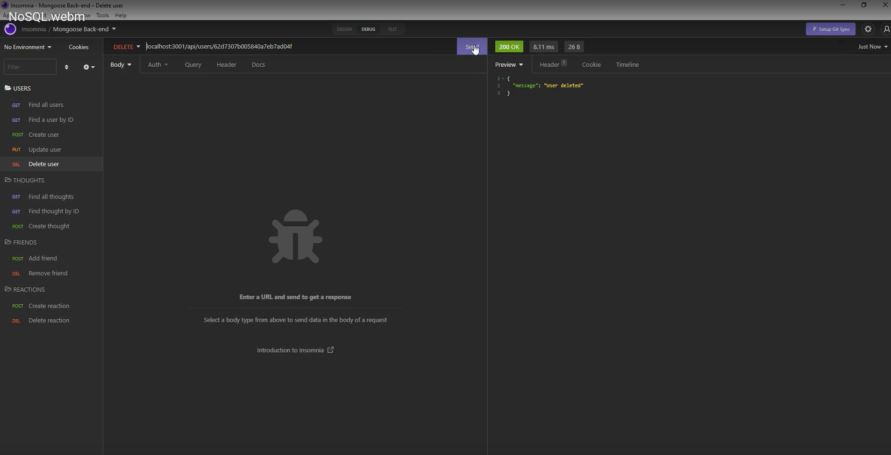
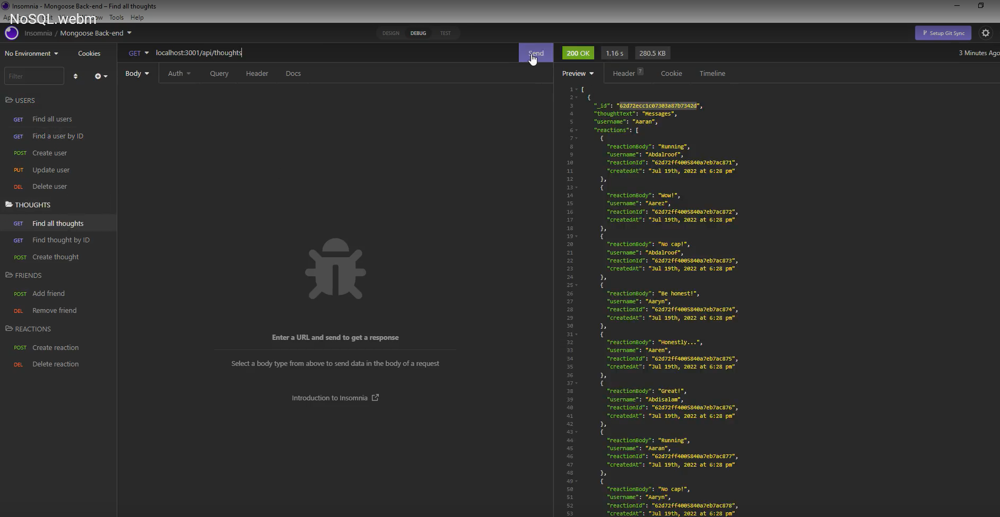
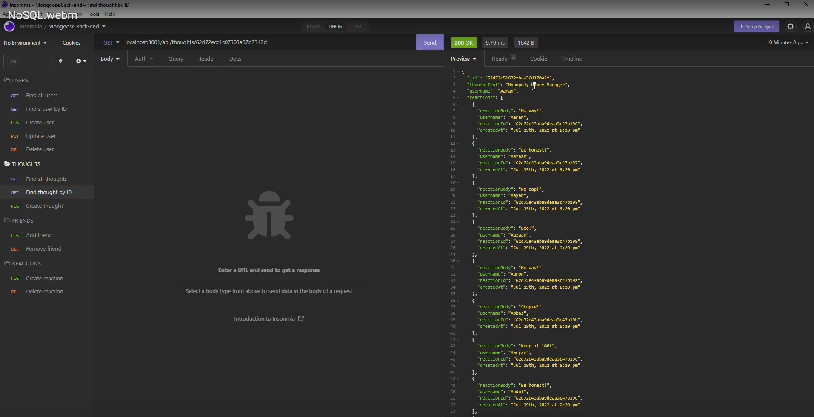
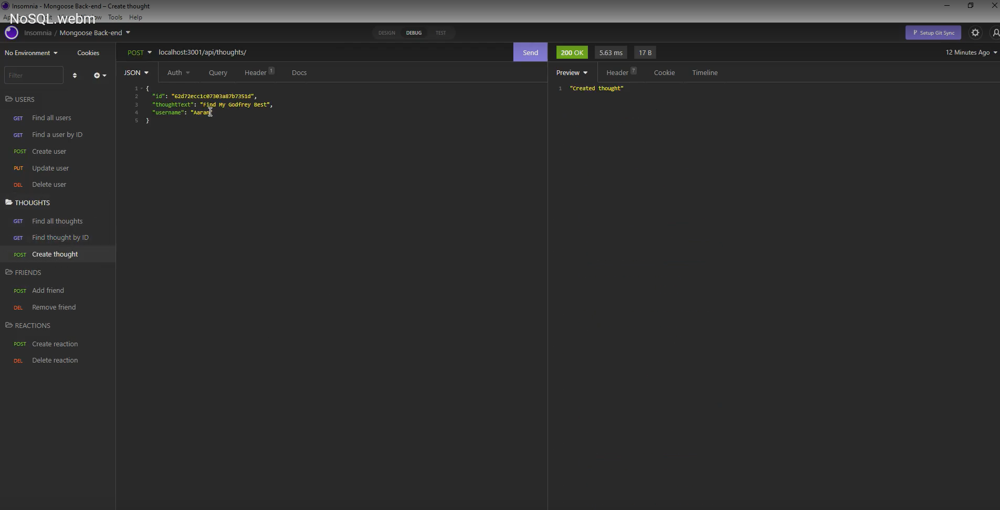
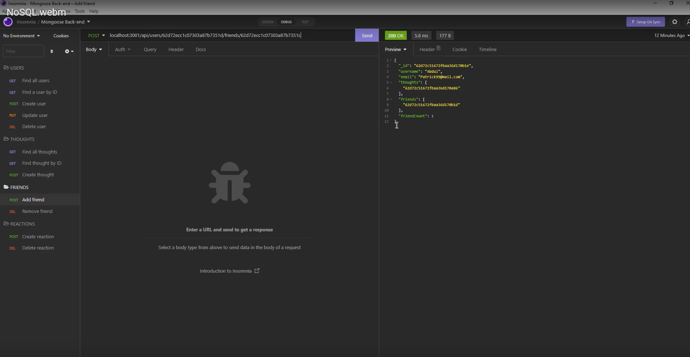
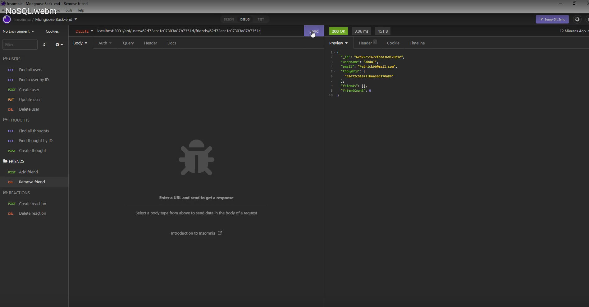
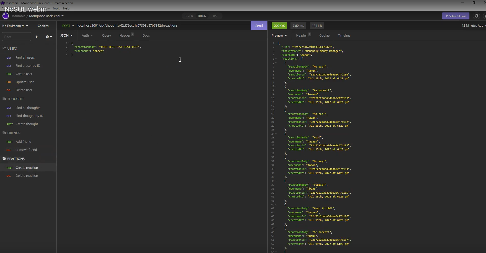
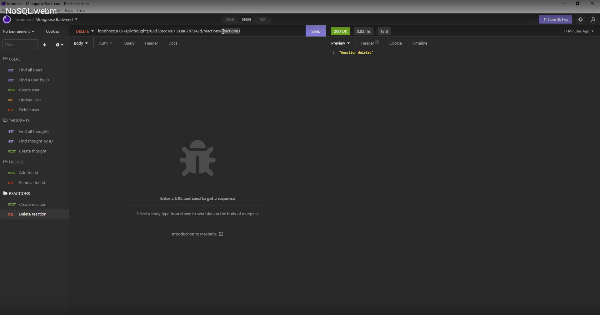

## Credits

[Trent Dickson - GitHub](https://github.com/tdickson96)
[LinkedIn](https://www.linkedin.com/in/tad96/)

## License

MIT License

Copyright (c) [2022] [Trent Dickson]

Permission is hereby granted, free of charge, to any person obtaining a copy
of this software and associated documentation files (the "Software"), to deal
in the Software without restriction, including without limitation the rights
to use, copy, modify, merge, publish, distribute, sublicense, and/or sell
copies of the Software, and to permit persons to whom the Software is
furnished to do so, subject to the following conditions:

The above copyright notice and this permission notice shall be included in all
copies or substantial portions of the Software.

THE SOFTWARE IS PROVIDED "AS IS", WITHOUT WARRANTY OF ANY KIND, EXPRESS OR
IMPLIED, INCLUDING BUT NOT LIMITED TO THE WARRANTIES OF MERCHANTABILITY,
FITNESS FOR A PARTICULAR PURPOSE AND NONINFRINGEMENT. IN NO EVENT SHALL THE
AUTHORS OR COPYRIGHT HOLDERS BE LIABLE FOR ANY CLAIM, DAMAGES OR OTHER
LIABILITY, WHETHER IN AN ACTION OF CONTRACT, TORT OR OTHERWISE, ARISING FROM,
OUT OF OR IN CONNECTION WITH THE SOFTWARE OR THE USE OR OTHER DEALINGS IN THE
SOFTWARE.